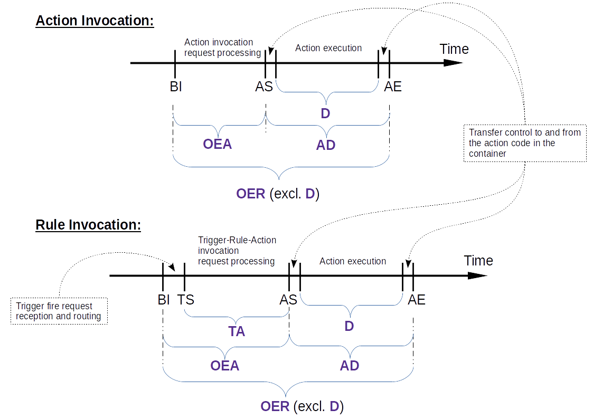

<!--
#
# Licensed to the Apache Software Foundation (ASF) under one or more
# contributor license agreements.  See the NOTICE file distributed with
# this work for additional information regarding copyright ownership.
# The ASF licenses this file to You under the Apache License, Version 2.0
# (the "License"); you may not use this file except in compliance with
# the License.  You may obtain a copy of the License at
#
#     http://www.apache.org/licenses/LICENSE-2.0
#
# Unless required by applicable law or agreed to in writing, software
# distributed under the License is distributed on an "AS IS" BASIS,
# WITHOUT WARRANTIES OR CONDITIONS OF ANY KIND, either express or implied.
# See the License for the specific language governing permissions and
# limitations under the License.
#
-->
# :electric_plug: Apache OpenWhisk - Performance Tests
A few simple but efficient test suites for determining the maximum throughput and end-user latency of the Apache OpenWhisk system.

## Workflow
- A standard OpenWhisk system is deployed. (_Note that the API Gateway is currently left out for the tests._)
- All limits are set to 999999, which in our current use case means "No throttling at all".
- The deployment is using the docker setup proposed by the OpenWhisk development team: `overlay` driver and HTTP API enabled via a UNIX port.

#### Travis Machine Setup
The [machine provided by Travis](https://docs.travis-ci.com/user/ci-environment/#Virtualization-environments) has ~2 CPU cores (likely shared through virtualization) and 7.5GB memory.

## Suites

### overhead

This suite is based on a tailored test tool written in node.js, using the modules of OpenWhisk client and cluster for concurrency.

#### General Info
This test suite benchmarks an OpenWhisk deployment for (warm) latency and throughput, with several new capabilities:
1. Measure performance of rules (trigger-to-action) in addition to actions
1. Deeper profiling without instrumentation (e.g., Kamino) by leveraging the activation records in addition to the client's timing data. This avoids special setups, and can help gain performance insights on third-party deployments of OpenWhisk. 
1. New tunables that can affect performance: 
   1. Parameter size - controls the size of the parameter passed to the action or event
   1. Actions per iteration (a.k.a. _ratio_) - controls how many rules are associated with a trigger [for rules] or how many actions are asynchronously invoked (burst size) at each iteration of a test worker [for actions].
1. "Master apart" mode - Allow the master client to perform latency measurements while the worker clients stress OpenWhisk using a specific invocation pattern in the background. Useful for measuring latency under load, and for comparing latencies of rules and actions under load.

#### Operation
The general operation of a test is simple: 
1. **Setup**: the tool creates the test action, test trigger, and a number of rules that matches the ratio tunable above.
1. **Test**: the tool fires up a specified number of concurrent clients - a master and workers. 
   1. Each client wakes up once every _delta_ msec (iteration) and invokes the specified activity: either the trigger (for rule testing) or multiple concurrent actions - matching the ratio tunable. All invocations are asynchronous.
   1. After each client has completed a number of initial iterations (warmup), measurement begins, controlled by the master client, for either a specified number of iterations or speficied time.
   1. At the end of the measurement, each client retrieves the activation records of its triggers and/or actions, and generates summary data that is sent to the master, which generates and prints the final results.
1. **Teardown**: clean up the OpenWhisk assets created during setup

Final results are written to the standard output stream (so can be redirected to a file) as a single highly-detailed CSV record containing all the input settings and the output measurements (see below). There is additional control information that is written to the standard error stream and can be silenced in CLI. The control information also contains the CSV header, so it can be copied into a spreadsheet if needed.

It is possible to invoke the tool in "Master apart" mode, where the master client is invoking a diffrent activity than the workers, and at possibly a different (very likely, much slower) rate. In this mode, latency statsitics are computed based solely on the master's data, since the worker's activity is used only as background to stress the OpenWhisk deployment. So one experiment can have the master client invoke rules and another one can have the master client invoke actions, while in both experiments the worker clients perform the same background activity.

The test action sleep delay is by default 50 msec. Sleep delay can be explicitly set via the tool CLI. More advanced users can replace the test action with a custom action to benchmark action or event-respose throughput and latency of specific applications.  

**Clock skew**: OpenWhisk is a distributed system, which means that clock skew is expected between the client machine computing invocation timestamps and the controllers or invokers that generate the timestamps in the activation records. However, this tool assumes that clock skew is bound at few msec range, due to having all machines clocks synchronized, typically using NTP. At such a scale, clock skew is quite small compared to the measured time periods. Some of the time periods are measured using the same clock (see below) and are therefore oblivious to clock skew issues.

#### Usage
The tool itself is located in the ```overhead``` sub-folder. It uses the settings in ```~/.wskprops``` to connect to OpenWhisk. You need to have node.js installed (v8+) and perform ```npm install``` in the tool folder before the first use to install the dependencies.

Using the tool follows the test operation described above:
1. Run ```./setup.sh <ratio>``` to setup the OpenWhisk assets for the experiment
1. Run ```node overhead.js <options>``` to perform the test. To see all the available options and defaults run ```node overhead.js -h```.
1. Run ```./teardown.sh <ratio>``` to clean up the assets after the experiment completes.

The default for ratio is 1. If using a different ratio, be sure to specify the same ratio value for all steps.

An example test:
1. Setup a test for a ratio of 4: ```./setup.sh 4```
1. Perform a test of rule performance with 3 clients, default delta of 200 msec, so 5 iterations per second per client, total of 15 iterations per second, for 100 iterations (counted at the master client, excluding the warmup), ratio of 4 (yielding 15x4=60 rule invocations per second): ```node overhead.js -a rule -w 3 -i 100 -r 4```
1. Clean up: ```./teardown.sh 4```

#### Measurements
As explained above, the overhead tool collects both latency and throughput data at each experiment.

##### Latency
The following time-stamps are collected for each invocation, of either action, or rule (containing an action):
* **BI** (Before Invocation) - taken by a client immediately before invoking - either the trigger fire (for rules), or the group of _ratio_ concurrent actions. All invoked actions in the same iteration have the same BI value. 
* **TS** (Trigger Start) - taken from the activation record of the trigger linked to the rules, so applies only to rule tests. All actions invoked by the rules of the same trigger have the same TS value.
* **AS** (Action Start) - taken from the activation record of the action. 
* **AE** (Action End) - taken from the activation record of the action.

Based on these timestamps, the following measurements are taken:
* **OEA** (Overhead of Entering Action) - OpenWhisk processing overhead from sending the action invocation or trigger fire to the beginning of the action execution. OEA = AS-BI
* **D** - the duration of the test action - as reported by the action itself in the return value.
* **AD** - Action Duration - as measured by OpenWhisk invoker. AD = AE - AS. Always expect that AD >= D.
* **OER** (Overhead of Executing Request) - OpenWhisk processing overhead from sending the action invocation or trigger fire to the completion of the action execution in the OpenWhisk Invoker. OER = AE-BI-D
* **TA** (Trigger to Answer) - the processing time from the start of the trigger process to the start of the action. TA = AS-TS

For each measurement, the tool computes average (_avg_), standard deviation (_std_), and extremes (_min_ and _max_).

The following chart depicts the relationship between the various measurements and the action invocation and rule invocation flows.



##### Throughput
Throughput is measured w.r.t. several different counters. During post-processing of an experiment, each counter value is divided by the measurement time period to compute a respective throughput.
* **Attempts** - number of invocation attempts performed inside the time frame (according to their BI). This is the "arrival rate" of invocations, should be close to _clients * ratio / delta_ .
* **Requests** - number of requests sent to OpenWhisk inside the time frame. Each action invocation is one request, and each trigger fire is also one request (so a client invoking rules at ratio _k_ generates _k+1_ requests).
* **Activations** - number of completed activations inside the time frame, counting both trigger activations (based on TS), and action activations (based on AS and AE). 
* **Invocations** - number of successful invocations of complete rules or actions (depending on the activity). This is the "service rate" of invocations (assuming errors happen only because OW is overloaded). 

For each counter, the tool reports the total counter value (_abs_), total throughput per second (_tp_), througput of the worker clients without the master (_tpw_) and the master's percentage of throughput relative to workers (_tpd_). The last two values are important mostly for master apart mode.

Aside from that, the tool also counts **errors**. Failed invocations - of actions, of triggers, or of actions from triggers (via rules) are counted each as an error. The tool reports both absolute error count (_abs_) and percent out of requests (_percent_). 

##### Acknowledgements
The overhead tool has been developed by IBM Research as part of the [CLASS](https://class-project.eu/) EU project. CLASS aims to integrate OpenWhisk as a foundation for latency-sensitive polyglot event-driven big-data analytics platform running on a compute continuum from the cloud to the edge. CLASS is funded by the European Union's Horizon 2020 Programme grant agreement No. 780622.
